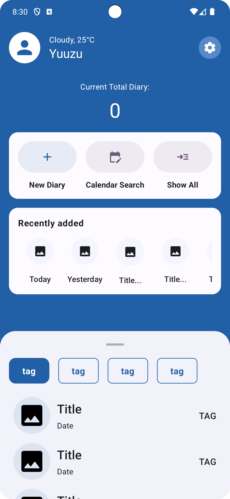

# Diary App

這個是一個Diary App，用於記錄個人日記也可以放張小圖片在上面～

## 開始使用

因為這是一個課程所以我有進行分支處理，所以如果跟不上還是需要看期間內容有哪些更動，就去分支列表上查看吧～

## Screenshots

[//]: # (### IOS)

[//]: # (
)

[//]: # (    <table>)

[//]: # (    <tr>)

[//]: # (        <td>)

[//]: # (            )

[//]: # (        </td>)

[//]: # (        <td>)

[//]: # (            )

[//]: # (        </td>)

[//]: # (    </tr>)

[//]: # (    </table>)

[//]: # (
)

### Android

    <table>
    <tr>
        <td>
            
        </td>
        <td>
            
        </td>
    </tr>
    </table>

## 功能

- [x]  FaceId/TouchId 驗證
- [x]  今日天氣資訊
- [x]  白天/夜間模式（隨手機設定）
- [x]  動態主題（Android限定）
- [x]  日記內容CRUD

## 使用技術

- Kotlin Multiplatform X Compose Multiplatform
- Coroutines
- StateFlow
- Dependency Injection (Koin)
- SQLDelight
- Ktor
- Moko libraries
- Precompose
- Clean Architecture
